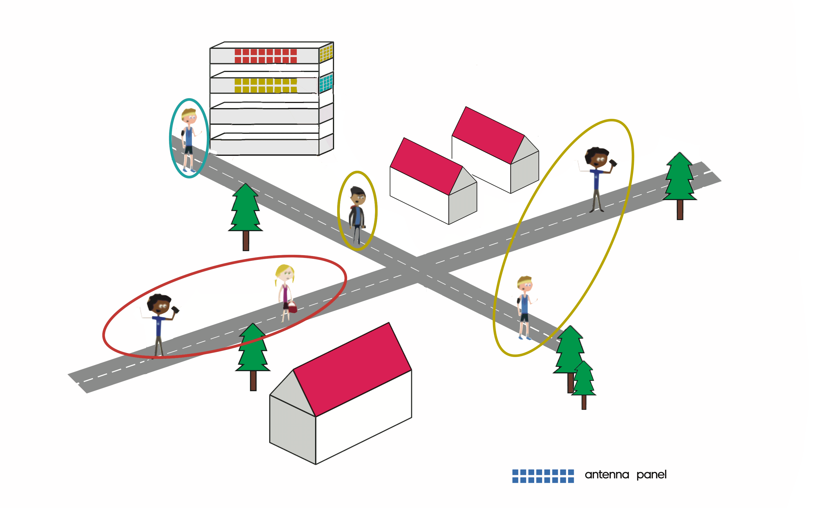

This work has been published in 2021 IEEE 4th 5G World Forum (5GWF). Find the publication to this work here: https://ieeexplore.ieee.org/document/9605020

# Dynamic Sectorization in Multi-Panel Massive MIMO Systems
- Dynamic user grouping in multi-panel massive MIMO scenario for 5G/ Beyond 5G networks. 

## Scenario 

- Investigation of a multi-panel base transceiver station (BTS) architecture for the realization of a massive MIMO system for 5G / Beyond 5G
- Opposite to conventional massive MIMO with a single BTS, where many antennas are co-located in one single large panel, it is assumed distributing the antennas into multiple panels to be more cost-efficient for future communication standards
- A big challenge is to find good associations, in the sense of best possible spectral efficiency, of users and panels by the realization of a dynamic sectorization with user-centric virtual cells for the multi-panel BTS
- The different BTSs are assumed to be distributed around the edges of a big building and to be connected to central processing and therefore jointly processable 
- Throughout the work, joint precoding of all panels as done in a conventional massive MIMO system serves as a comparable scheme
- It is aimed to dynamically choose the partition which leads to the best downlink sum-rate

## Results

- The developed algorithm is a combination of a Mixed Integer Program followed by a greedy local optimization technique
- The approach boosts the sum-rate in a practical downlink scenario by over 70% compared to the centralized scheme
